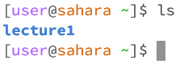
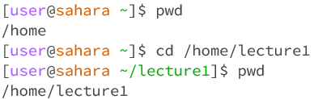
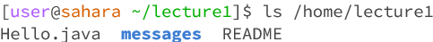
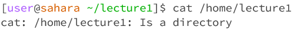
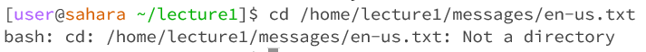
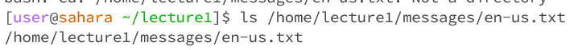
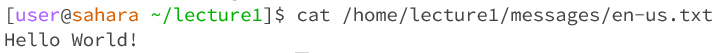

# __Lab Report 1__
October 4, 2023
Nicholas Hubbard

For each of the commands cd, ls, and cat, and using the workspace you created in this lab:

## Share an example of using the command with no arguments.
    
-cd did not return anything, because as a command it does not have an output. It simply changes the working directory when given an argument.
-Working directory: /home
-This is not an error.

    
ls returned "lecture1" because it will return the list of files/folders in the current directory, which is still /home
Working directory: /home
This is not an error.

    
cat does not return anything.
Working directory: /home
This is an error, because the terminal stops working.

## Share an exmaple of using the command with a path to a directory as an argument.

cd stil does not return anything, for the same reason as before.
Working directory: /home
This is not an error.

ls returned the list of files and folders within /home, because that was the selected working directory.
Working directory: /home
This is not an error.

cat returned "/home/lecture1: Is a directory" because it is supposed to read what is in the file, but the given argument was a directory.
Working directory: /home
This is not an error.

## Share an example of using the command with a path to a file as an argument.

cd returns a bash error, because it is expecting a directory as its argument, not a file.
Working directory: /home
This is an error.

ls just returns the pathway towards the requested file.
Working directory: /home
This is not an error.

cat returns the contents of the requested file.
Working directory: /home
This is not an error.

