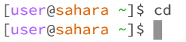
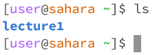
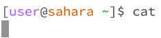

# __Lab Report 1__
October 4, 2023
Nicholas Hubbard

For each of the commands cd, ls, and cat, and using the workspace you created in this lab:

## Share an example of using the command with no arguments.
    
    -cd did not return anything, because as a command it does not have an output. It simply changes the working directory when given an argument.
    Working directory: /home
    This is not an error, because cd is not meant to return anything.
    
    
    -ls returned "lecture1" because it will return the list of files/folders in the current directory, which is still /home
    Working directory: /home
    This is not an error, because it works properly.
    
    
    -cat does not return anything
    Working directory: /home
    This is an error, because the terminal stops working.
    
    
## Share an exmaple of using the command with a path to a directory as an argument.
    
## Share an example of using the command with a path to a file as an argument.

