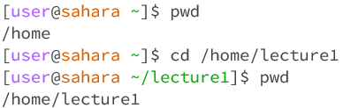
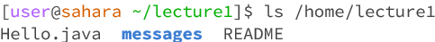
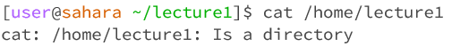
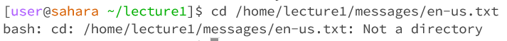
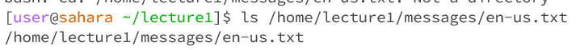
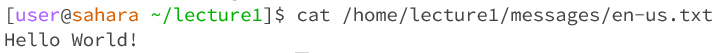

# __Lab Report 1__
October 4, 2023
Nicholas Hubbard

## Share an example of using the command with no arguments.
    
1. \`cd did not return anything, because as a command it does not have an output. It simply changes the working directory when given an argument. However, when given the command, \`cd, whilst in a different directory, such as \`/home/lecture1, the working directory is reset to \`/home.     
Working directory: `/home   
This is not an error.   

    
2. \`ls returned "lecture1" because it will return the list of objects in the current directory, which is still \`/home  
Working directory: `/home  
This is not an error.  

    
3. \`cat does not return anything.  
Working directory: `/home  
This is not an error, however it is the cause of an infinite loop. Using Ctrl+C will stop the loop.  

## Share an exmaple of using the command with a path to a directory as an argument.

1. \`cd stil does not return anything, for the same reason as before.  
Working directory: `/home/lecture1  
This is not an error.  

2. \`ls returned the list of files and folders directly within \`/home, being Hello.java, messages, and README, because that was the selected working directory.  
Working directory: `/home
This is not an error.  

3. \`cat returned "/home/lecture1: Is a directory" because it is supposed to read what is in the file, but the given argument was a directory.  
Working directory: \`/home
This is an error.  `cat is supposed to return the contents of the requested file, but in this case it was given a directory.

## Share an example of using the command with a path to a file as an argument.

1. \`cd returns a bash error, because it is expecting a directory as its argument, not a file. This is because the command \`cd is meant to change the current working directory to the requested one.  
Working directory: `/home  
This is an error.  

2. \`ls just returns the pathway towards the requested file.  
Working directory: `/home  
This is not an error.  

3. \`cat returns the contents of the requested file.  
Working directory: `/home  
This is not an error.  

