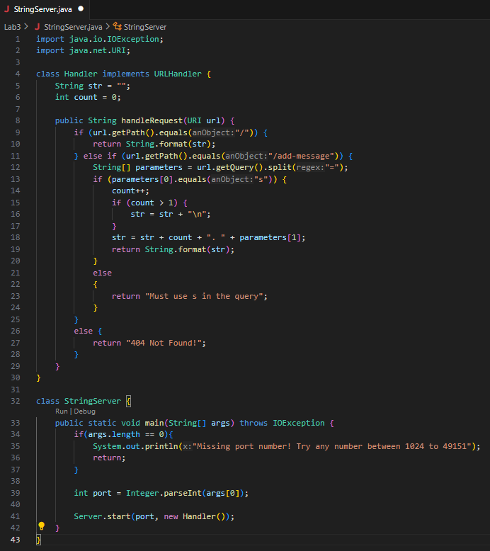
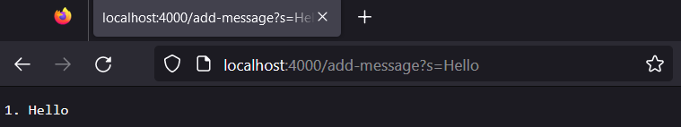
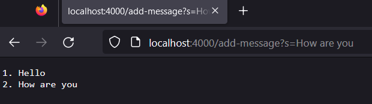

# __Lab Report 1__
October 18, 2023  
Nicholas Hubbard  

##Part 1      
    

    
The handleRequest(URI url) method is called upon entering localhost:4000/add-message?s=Hello. The relevant argument is the url itself, with importance being placed upon the path /add-message and the query ?s=Hello. Before the method is executed, the str field is still empty, and the count is still 0. Following the execution of this method, the str field becomes "1. Hello", and the count field becomes 1.  

    
The same method is called after this url is entered, however the relevant argument is of course different. The path is the same: /add-message, however the query is different: ?s=How are you. The str field becomes "1. Hello\n2. How are you" and the count increments by 1, becoming 2.  

##Part 2    

##Part 3    
Before week 2, I did not know you could remotely access another computer using the ssh command. The example we went over in class was remotely connecting to the basement computers to run the NumberServer.java file, allowing for multiple devices to all access the server, as opposed to only using localhost:<port> on the computer being used.
