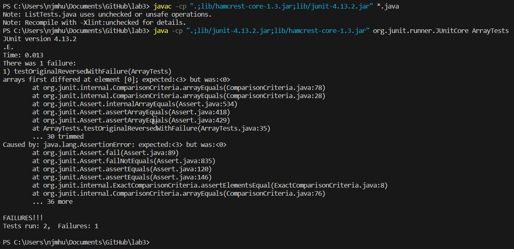

# __Lab Report 3__  
November 5, 2023  
Nicholas Hubbard  

## Part 1
The Buggy Program:  
~~~
static int[] originalReversed(int[] arr) {
    int[] newArray = new int[arr.length];
    for(int i = 0; i < arr.length; i += 1) {
      arr[i] = newArray[arr.length - i - 1];
    }
    return arr;
  }
~~~  

Failure-Inducing Input for the Buggy Program:  
~~~
@Test
  public void testOriginalReversed() {
    int[] input1 = {1, 2, 3};
    assertArrayEquals(new int[] {3, 2, 1}, ArrayExamples.originalReversed(input1));
  }
~~~  

Non-Failure-Inducing Input for the Buggy Program:  
~~~
@Test
  public void testOriginalReversedNoFailure() {
    int[] input1 = {};
    assertArrayEquals(new int[] {}, ArrayExamples.originalReversed(input1));
  }
~~~

The Symptom:  
  

The buggy code was shared at the start of this report.    
The new code:
~~~
static int[] fixedReversed(int[] arr) {
    int[] newArray = new int[arr.length];
    for(int i = 0; i < arr.length; i += 1) {
      newArray[i] = arr[arr.length - i - 1];
    }
    return newArray;
  }
~~~

The old code was incorrect because it was trying to put the values of the holder\`newArray array into the input \`arr array, and then return the input array. The new code solves this problem by moving the input array's values into the newArray from back-to-front, then returning the newArray.  

## Part 2  
Let's look at the `find command.  
Here are 4 interesting command-line options:  

1. -type

The first example I will show is -type d, where d means directory.  
~~~
$ find technical/ -type d
technica/
technical/911report
technical/biomed
technical/government
technical/government/About_LSC
technical/government/Alcohol_Problems
technical/government/Env_Prot_Agen
techncial/government/Gen_Account_Office
technical/government/Media
technica/government/Post_Rate_Comm
technical/plos
~~~
The second example is with -type f, for normal files.
>This example actually produces all 1391 .txt files, but for the sake of the report, I redirected the output into another text file, upon which I ran `wc to show its details.
~~~
$ find technical/ -type f > type-f-results.txt
wc type-f-results.txt
1391 1391 54178 type-f-results.txt
~~~

Using -type followed by a letter corresponding to a type of result will limit results to just the requested type. This command is useful when searching huge directories of different file types.  

2. -maxdepth  

The first example of -maxdepth is -maxdepth 0.
~~~
$ find technical/ -maxdepth 0
technical/
~~~
The second example will be -maxdepth 1, meaning the find will searchh with depth 1, which is similar to running `ls.
~~~
$ find technical/ -maxdepth 1
technical/
technical/911report
technical/biomed
technical/government
technical/plos
~~~

Using -maxdepth is an interesting command-line option, as it limits the depth of folders that will be searched when running `find. This command is useful when looking in directories that have many sub-directories.  

3. -name

The first example will be -name "chapter-1.txt" which should only return the .txt file within 911report, as it is the only file named chapter-1.txt in the technical/ directory.
~~~
$ find technical/ -name "chapter-1.txt"
technical/911report/chapter-1.txt
~~~
The second example will be -name "chapter*.txt" which uses an asterisk to give the user the chance to look for all files with the title starting with the word chapter.
~~~
$ find technical/ -name "chapter*.txt"
technical/911report/chapter-1.txt
technical/911report/chapter-10.txt
technical/911report/chapter-11.txt
technical/911report/chapter-12.txt
technical/911report/chapter-13.1.txt
technical/911report/chapter-13.2.txt
technical/911report/chapter-13.3.txt
technical/911report/chapter-13.4.txt
technical/911report/chapter-13.5.txt
technical/911report/chapter-2.txt
technical/911report/chapter-3.txt
technical/911report/chapter-5.txt
technical/911report/chapter-6.txt
technical/911report/chapter-7.txt
technical/911report/chapter-8.txt
technical/911report/chapter-9.txt
~~~

Using -name is extremely useful when it comes to looking for a file that could be buried within multiple sub-directories but you know the name of. It could also be useful for looking for multiple files that all have similar file names.  

4. -delete

The first example I will show is using -delete to delete all files within /government/About_LSC
~~~
$ find technical/government/About_LSC -delete

njmhu@nicks-g14 MINGW64 ~/Documents/GitHub/docsearch (main)
$ ls technical/government/
Alcohol_Problems/    Media/
Env_Prot_Agen/       Post_Rate_Comm/
Gen_Account_Office/
~~~
The second example will be using it in combination with -name in order to delete 3 of the 4 .txt files in /government/Alcohol_Problems based on their name having "Session"
~~~
$ find technical/government/Alcohol_Problems -na
me Session*.txt -delete

njmhu@nicks-g14 MINGW64 ~/Documents/GitHub/docsearch (main)
$ ls technical/government/Alcohol_Problems
DraftRecom-PDF.txt
~~~

This command is very useful when it comes to clearing out files. It becomes even more useful in conjunction with other command-line options that can help narrow down which files will be deleted.  

** I found about all of the first 3 examples from redhat.com/sysadminn/linux-find-command and the final example from linuxteck.com/find-command-in-linux-with-examples/ **
