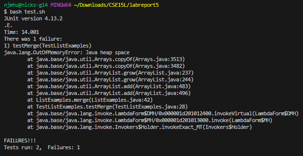
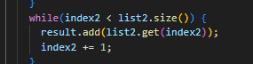
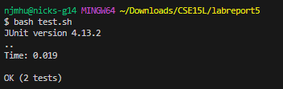

# __Lab Report 5__
December 3, 2023
Nicholas Hubbard

------------
## Part 1 - Debugging Scenario
Anonymous:
Hello, I am trying to debug the ListExamples.java file, but I'm getting an error saying "java.lang.OutOfMemoryError: Java heap space"

I found some articles describing the error and its possible causes (memory leaks, large data sets, insufficient heap size, or poor memory management) and I believe it would have to do with a memory leak, as the sets themselves are very small.

TA:
Hello, thank you for the question. I think you are onto the right path with the memory leak suggestion. I'd bet that the issue is stemming from an unintentionally infinite loop, so double check all of your loops.

Anonymous:
Hi, thank you for your help. I found the bug in the while loop at line 41, where the index1 variable was being incremented instead of index2, so the while's condition was never fulfilled.

INFORMATION:

## Part 2 - Reflection
One piece of lab material that I found very interesting was our focus on vim. I think that the ability to change file contents from within the terminal was extremely fascinating. Especially regarding its usage in the fourth skill demo, changing the contents of a .java file for the sake of debugging is something that really helped me see its application in real-time.
